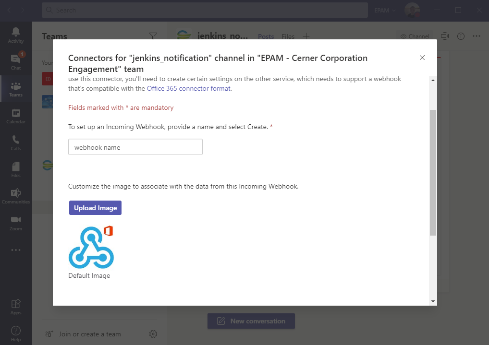

## Teams notification WebHook manual

### 1) Choose chanel in Teams;
### 2) Click on "More options";

### 3) Choose "Connectors";

### 4) Find "Incoming WebHook" from list of connectors and click "Add"/"Configure";

### 5) Set name for webhook;

### 6) Click "Create";

### 7) After creation scroll down and there will be webhook's URL.

